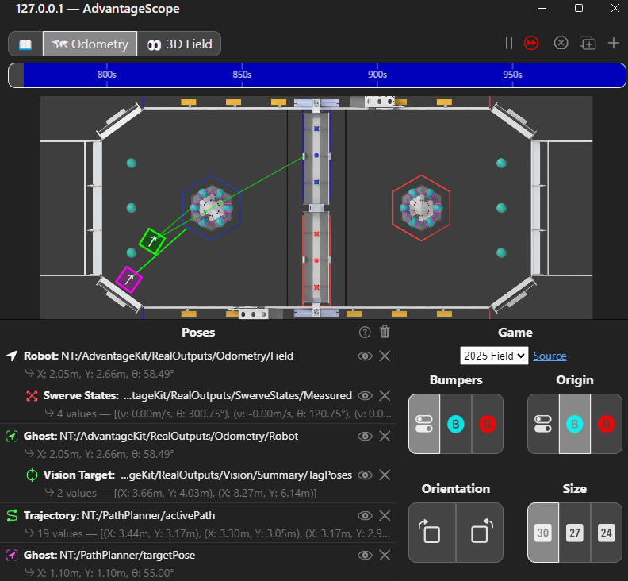
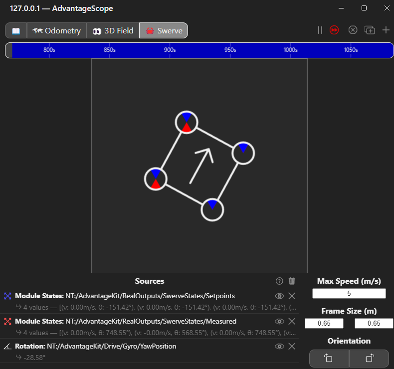
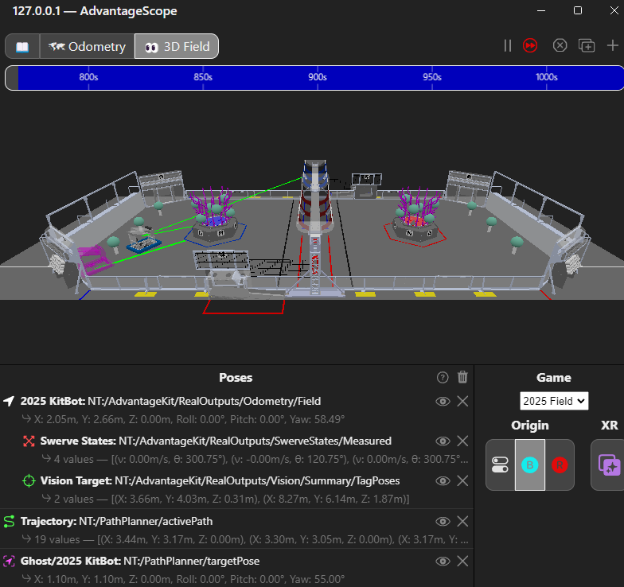

# Contributing

This repository is open to contributions. If you would like to contribute, please follow the guidelines below.

## Dependencies

Dependencies are automatically installed unless specified otherwise. The following dependencies are used in this project:

 - [AdvantageKit](https://docs.advantagekit.org/)
     - For use with [AdvantageScope](https://docs.advantagescope.org/)
 - [PathplannerLib](https://pathplanner.dev/pathplannerlib.html)
     - For use with [PathPlanner](https://pathplanner.dev/home.html) (needs to be installed separately)
 - [CTRE Phoenix 6](https://v6.docs.ctr-electronics.com/en/stable/)
 - [REVLib](https://docs.revrobotics.com/revlib)
 - [Limelight](https://docs.limelightvision.io/docs/docs-limelight/apis/limelight-lib)

## Getting Started

To get started, install WPILib and the necessary software. You can find the installation instructions [here](https://docs.wpilib.org/en/stable/docs/zero-to-robot/step-2/wpilib-setup.html).

You will also need git installed on your computer. You can find the installation instructions [here](https://git-scm.com/book/en/v2/Getting-Started-Installing-Git).

The first way is to code on your own computer.

1. Install the above software.
2. Open Visual Studio Code (you should find a shortcut to the WPILib VSCode in the desktop).
3. Open the terminal (press `Ctrl+backtick`)
4. Clone the repository by running `git clone https://github.com/frc8100/reefscape-bot-2025.git` in the terminal.
    - You could alternatively clone the repository using VSCode's built-in Git functionality.
5. Open the cloned repository in Visual Studio Code.
6. You can now start coding.
    - Gradle will automatically download the necessary dependencies.

## Deploying Code

See the [WPILib documentation](https://docs.wpilib.org/en/stable/docs/software/vscode-overview/deploying-robot-code.html) for more information on deploying code.

## Simulation

Once you have the code, you can run the simulation.

1. Open the WPILib command palette (press `Ctrl+Shift+P`).
2. Search for `WPILib: Simulate Robot Code` and press enter.
    - When asked for extensions to run, select `Sim GUI` (only select `Use Real Driver Station` if you have a real controller connected).
3. Configure the keyboard controls.
    - Drag `16: Keyboard 0` from the `System Joysticks` tab to the `Joysticks[0]` tab.
    - You can change the keyboard controls by clicking on the `DS` tab on the top and enabling `Keyboard 0 Settings`.
    - Configure the values of the axis and buttons to your liking. You should click the `+` on Axes count until there are 5 axes, and the `+` on Buttons count until there are 6 buttons. See the simulation to controller mapping table below.
4. Enable the simulation into teleop mode.
5. Open AdvantageScope.
6. In AdvantageScope, connect to the simulation by pressing `Ctrl+Shift+K`.
7. Drag the logged telemetry values to the `Odometry`, `Swerve`, and `3D Field` tabs. They should look the same as the image below.
8. You can now see and drive the robot in simulation.

Note: you must be focused on the `Sim GUI` window for keyboard controls to work.





### Simulation to Controller Mapping

| Simulation Button | Controller Button |
| --- | ----------------- |
| Axis 0 | Left Axis X |
| Axis 1 | Left Axis Y |
| Axis 2 | Left Trigger (L2) |
| Axis 3 | Right Trigger (R2) |
| Axis 4 | Right Axis X |
| Axis 5 | Right Axis Y (unused) |
| Button 1 | A |
| Button 2 | B |
| Button 3 | X |
| Button 4 | Y |
| Button 5 | Left Bumper (L1) |
| Button 6 | Right Bumper (R1) |

## Linting

Requirements:
 - [Node.js](https://nodejs.org/en/download/)
    - [npm](https://www.npmjs.com/get-npm) (comes with Node.js)

This project uses [Prettier](https://prettier.io/) for code formatting. You can install the [Prettier VSCode extension](https://marketplace.visualstudio.com/items?itemName=esbenp.prettier-vscode) to automatically format your code on save.

To run Prettier manually, run the following command in the terminal (after installing dependencies using `npm install`):

```bash
npm run prettier
```

## Saving and Pulling Changes

Once you make changes, you can upload (commit/push) your changes.

If any changes are made on this repository, you also need to pull/sync the changes.

1. (Recommended) Using the VSCode GUI: On the left side of the screen, there is a button that says `Source Control`. Open the screen. You can write a commit message and push.

2. Using the Git CLI: there are two ways to do this: you can commit them by running `git add .`, `git commit -m "Your message here"`, and `git push` in the terminal.

> [!NOTE]
> You may have to run the [first time git setup](https://git-scm.com/book/en/v2/Getting-Started-First-Time-Git-Setup) to commit/pull your changes

> [!TIP]
> It is recommended for you to learn how to write good git commit messages.
>
> Please read [this gist](https://gist.github.com/robertpainsi/b632364184e70900af4ab688decf6f53)
> and [this article](https://www.gitkraken.com/learn/git/best-practices/git-commit-message)
>
> Also, see [this article](https://www.atlassian.com/git) and [this article](https://product.hubspot.com/blog/git-and-github-tutorial-for-beginners) for more info about git.

For more details on source control, see the [Git documentation](https://git-scm.com/doc).

## Troubleshooting

If you encounter issues related to dependencies, try `Java: Clean Java Language Server Workspace` in the command palette.
